# 字帖功能核心数据流与组件依赖图

## 1. 功能概述

墨韵字帖生成器是一款支持**汉字、数字、英文**三种类型的在线书法练习字帖生成工具。核心功能包括：
- 多类型字帖生成（汉字/数字/英文）
- 多种书法字体切换
- 丰富的样式配置（网格、颜色、纸张质感等）
- 实时预览与临摹练字
- PDF/图片导出
- 练字打卡与海报生成

---

## 2. 核心状态管理架构

### 2.1 Zustand Store 分层设计

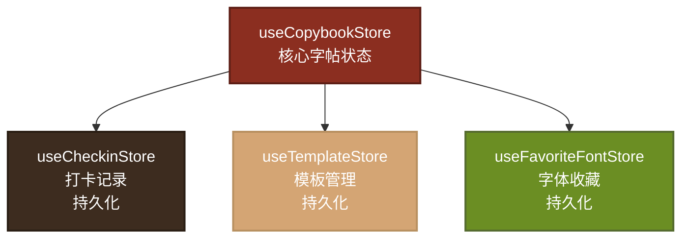

### 2.2 核心状态管理：useCopybookStore

**文件位置**：[useCopybookStore.ts](file:///Volumes/ExMac/traeProject/全站1/yq-34/src/store/useCopybookStore.ts)

#### 状态结构

| 分类 | 关键字段 | 类型 | 说明 |
|------|---------|------|------|
| **字帖配置** | `textType` | `TextType` | 字帖类型：chinese/number/english |
| | `text` | `string` | 字帖文字内容 |
| | `fontId` | `string` | 字体ID |
| | `gridType` | `GridType` | 网格类型：tian/mi/hui/none |
| | `cellSize` | `number` | 格子大小 |
| | `colsPerRow` | `number` | 每行字数 |
| | `rows` | `number` | 行数 |
| | `writingDirection` | `WritingDirection` | 书写方向 |
| **样式配置** | `fontColor` | `string` | 字体颜色 |
| | `gridColor` | `string` | 网格颜色 |
| | `showDashed` | `boolean` | 是否显示虚线 |
| | `showTrace` | `boolean` | 是否显示描红 |
| | `traceOpacity` | `number` | 描红透明度 |
| | `paperTexture` | `PaperTexture` | 纸张质感 |
| **页眉配置** | `title` / `subtitle` | `string` | 标题/副标题 |
| | `nameField` / `dateField` | `HeaderFieldConfig` | 姓名/日期字段 |
| **水印配置** | `watermark` | `WatermarkConfig` | 水印设置 |
| **绘图状态** | `penColor` / `penWidth` | `string/number` | 画笔颜色/粗细 |
| | `drawingEnabled` | `boolean` | 临摹模式开关 |
| | `pagePaths` | `PageDrawingPaths` | 各页绘制路径 |
| | `pageRedoStack` | `PageDrawingPaths` | 重做栈 |
| **进度状态** | `completedCells` | `CompletedCells` | 完成的格子 |
| | `difficultyLevel` | `DifficultyLevel` | 难度等级 |
| **文字处理** | `minStroke` / `maxStroke` | `number` | 笔画筛选范围 |
| | `sortMode` | `SortMode` | 排序模式 |

#### 核心 Action 方法

```typescript
// 配置更新
setTextType(type)      // 切换字帖类型（自动切换预设文字和字体）
setText(text)          // 更新文字内容
setFontId(fontId)      // 切换字体
setGridType(gridType)  // 切换网格类型
updateConfig(partial)  // 批量更新配置
resetConfig()          // 重置所有配置

// 绘图操作
addPathToPage(pageIndex, path)  // 添加绘制路径
undoPath(pageIndex)             // 撤销
redoPath(pageIndex)             // 重做
clearAllPaths()                 // 清除所有路径

// 难度模式
setDifficultyLevel(level)       // 切换难度（自动应用预设配置）

// 进度跟踪
setCellCompletion(page, cellKey, completion)  // 设置格子完成度
getCompletionPercentage()                     // 获取完成百分比
getTotalValidCells()                          // 获取总格子数

// 文字处理
applyStrokeFilter()     // 应用笔画筛选
applyTextSort()         // 应用文字排序
resetTextProcessing()   // 重置文字处理
```

#### 难度预设配置

| 难度 | 格子大小 | 每行字数 | 行数 | 网格类型 | 描红透明度 |
|------|---------|---------|------|---------|-----------|
| beginner | 80px | 8 | 10 | mi | 0.4 |
| intermediate | 64px | 10 | 14 | tian | 0.25 |
| advanced | 48px | 14 | 18 | hui | 0.1 |

---

## 3. 核心数据流

### 3.1 整体数据流图

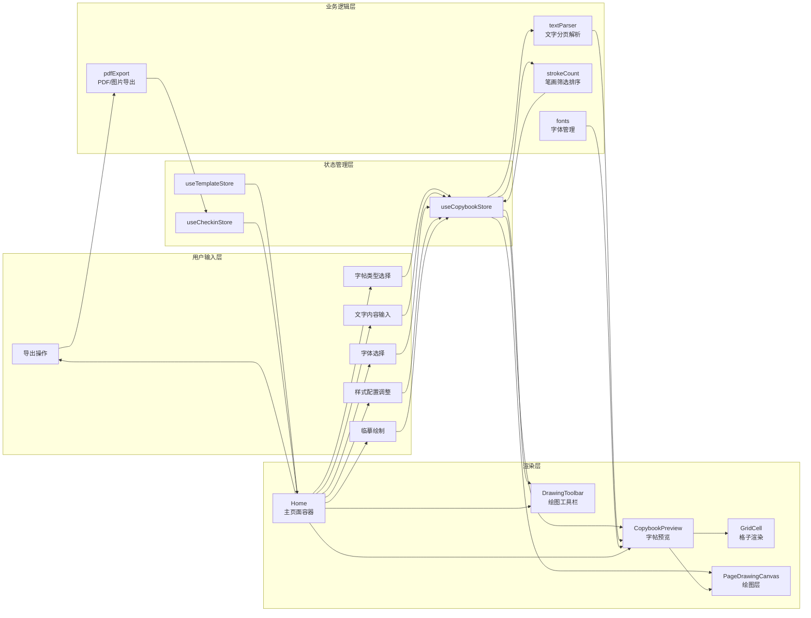

### 3.2 字帖生成数据流（详细）

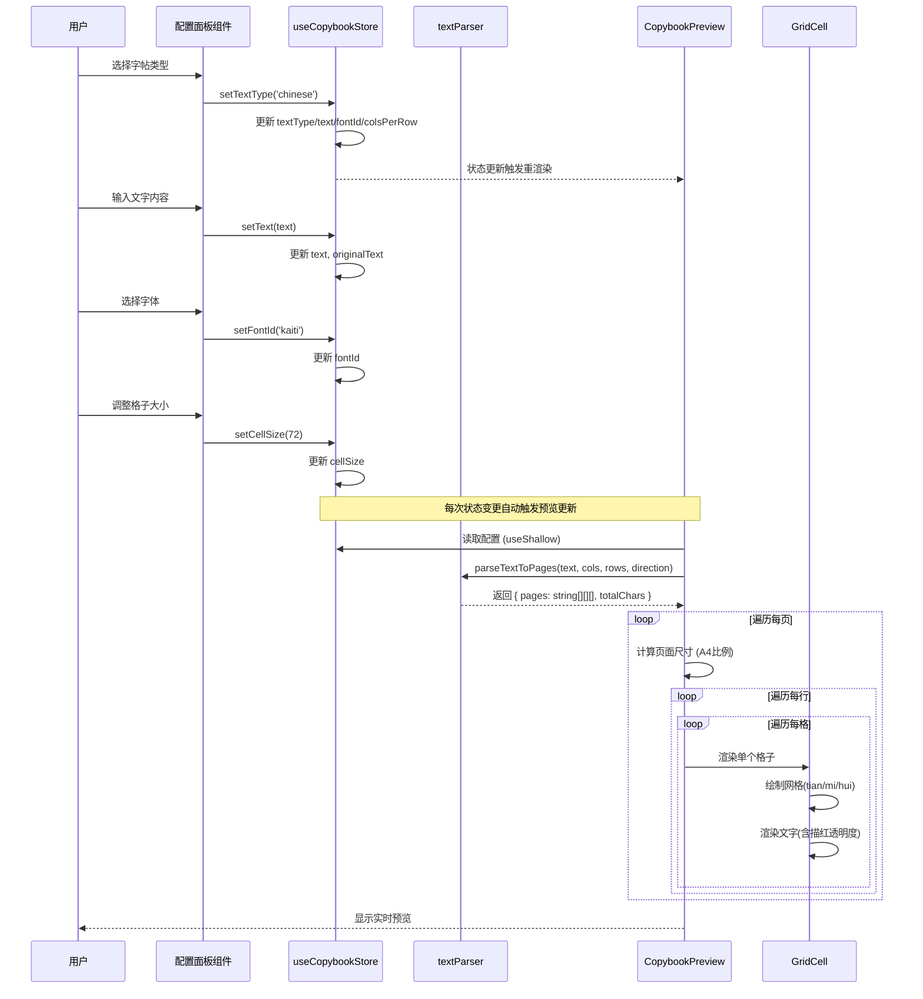

### 3.3 临摹练字数据流

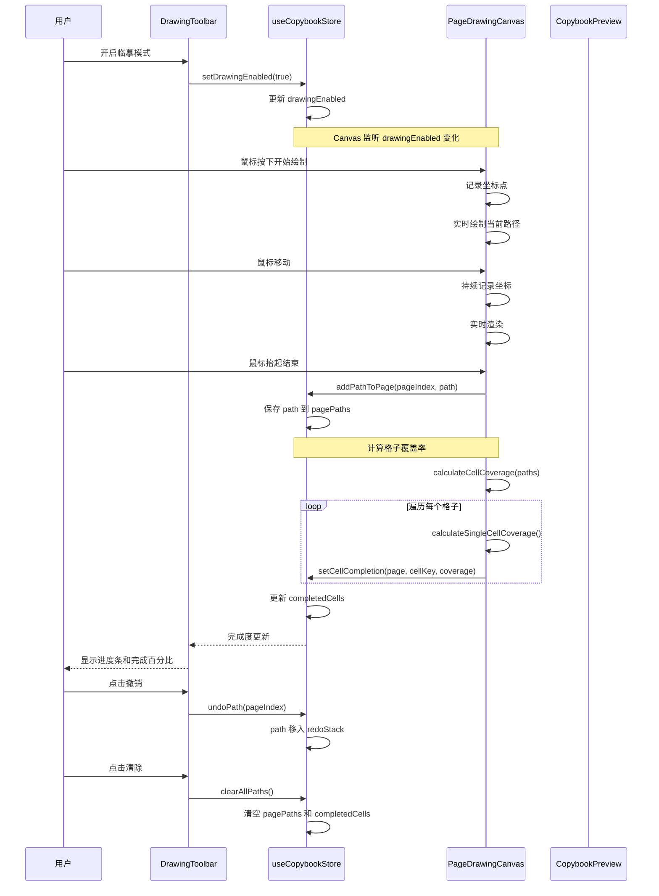

### 3.4 导出与打卡数据流

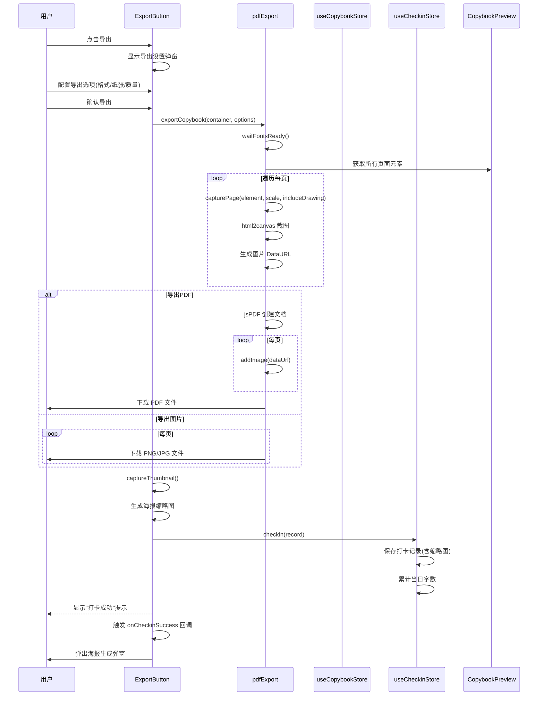

---

## 4. 组件依赖关系

### 4.1 主页面组件结构

**文件位置**：[Home.tsx](file:///Volumes/ExMac/traeProject/全站1/yq-34/src/pages/Home.tsx)

```mermaid
graph TD
    Home[Home.tsx<br/>主页面] --> Header[顶部标题区]
    Home --> ConfigPanel[左侧配置面板<br/>sticky]
    Home --> PreviewSection[右侧预览区]
    Home --> Footer[底部页脚]
    Home --> PosterGenerator[海报生成弹窗]
    Home --> StrokeAnimationModal[笔画动画弹窗]
    Home --> FontCompareModal[字体对比弹窗]
    
    ConfigPanel --> TemplateManager[模板管理器]
    ConfigPanel --> TextTypeSelector[字帖类型选择]
    ConfigPanel --> TextInput[文字输入]
    ConfigPanel --> TextProcessor[文字处理]
    ConfigPanel --> FontSelector[字体选择]
    ConfigPanel --> DifficultySelector[难度模式]
    ConfigPanel --> GridConfig[字帖布局]
    ConfigPanel --> HeaderConfig[页眉设置]
    ConfigPanel --> ColorConfig[颜色设置]
    ConfigPanel --> PaperTextureSelector[纸张质感]
    ConfigPanel --> WatermarkConfig[水印设置]
    ConfigPanel --> ExportButton[导出按钮]
    
    PreviewSection --> Stats[统计信息卡片<br/>4个]
    PreviewSection --> DrawingToolbar[临摹工具栏<br/>sticky]
    PreviewSection --> CopybookPreview[字帖预览]
    PreviewSection --> Tips[使用小贴士]
    PreviewSection --> CalendarView[打卡日历]
    
    style Home fill:#8B2E20,color:#fff
    style ConfigPanel fill:#D4A574
    style PreviewSection fill:#3D2C1F,color:#fff
```

### 4.2 配置面板组件依赖

| 组件 | 文件位置 | 依赖 Store | 主要功能 |
|------|---------|-----------|---------|
| **TextTypeSelector** | [TextTypeSelector.tsx](file:///Volumes/ExMac/traeProject/全站1/yq-34/src/components/ConfigPanel/TextTypeSelector.tsx) | `textType`, `setTextType` | 切换汉字/数字/英文 |
| **TextInput** | [TextInput.tsx](file:///Volumes/ExMac/traeProject/全站1/yq-34/src/components/ConfigPanel/TextInput.tsx) | `text`, `setText`, `textType` | 自定义文字输入、预设文字选择 |
| **TextProcessor** | [TextProcessor.tsx](file:///Volumes/ExMac/traeProject/全站1/yq-34/src/components/ConfigPanel/TextProcessor.tsx) | `minStroke`, `maxStroke`, `sortMode`, `applyStrokeFilter`, `resetTextProcessing` | 笔画筛选、排序、打乱 |
| **FontSelector** | [FontSelector.tsx](file:///Volumes/ExMac/traeProject/全站1/yq-34/src/components/ConfigPanel/FontSelector.tsx) | `fontId`, `setFontId`, `textType` | 字体选择、收藏、对比 |
| **DifficultySelector** | [DifficultySelector.tsx](file:///Volumes/ExMac/traeProject/全站1/yq-34/src/components/ConfigPanel/DifficultySelector.tsx) | `difficultyLevel`, `setDifficultyLevel` | 入门/进阶/挑战模式 |
| **GridConfig** | [GridConfig.tsx](file:///Volumes/ExMac/traeProject/全站1/yq-34/src/components/ConfigPanel/GridConfig.tsx) | `gridType`, `cellSize`, `colsPerRow`, `rows`, `writingDirection`, `showDashed`, `showTrace`, `traceOpacity`, `traceDisplayMode` | 网格类型、大小、行列、方向、描红设置 |
| **HeaderConfig** | [HeaderConfig.tsx](file:///Volumes/ExMac/traeProject/全站1/yq-34/src/components/ConfigPanel/HeaderConfig.tsx) | `title`, `subtitle`, `nameField`, `dateField`, `classField`, `headerPosition`, `showLineNumbers` | 标题、副标题、姓名字段、行号 |
| **ColorConfig** | [ColorConfig.tsx](file:///Volumes/ExMac/traeProject/全站1/yq-34/src/components/ConfigPanel/ColorConfig.tsx) | `fontColor`, `gridColor`, `applyColorTheme` | 字体颜色、网格颜色、主题预设 |
| **PaperTextureSelector** | [PaperTextureSelector.tsx](file:///Volumes/ExMac/traeProject/全站1/yq-34/src/components/ConfigPanel/PaperTextureSelector.tsx) | `paperTexture`, `setPaperTexture` | 白纸/牛皮纸/宣纸/羊皮纸等 |
| **WatermarkConfig** | [WatermarkConfig.tsx](file:///Volumes/ExMac/traeProject/全站1/yq-34/src/components/ConfigPanel/WatermarkConfig.tsx) | `watermark`, `setWatermarkEnabled`, `setWatermarkText`, `setWatermarkPosition`, `setWatermarkFontSize`, `setWatermarkOpacity`, `setWatermarkColor` | 水印开关、文字、位置、大小、透明度 |

### 4.3 预览组件结构

**文件位置**：[CopybookPreview.tsx](file:///Volumes/ExMac/traeProject/全站1/yq-34/src/components/Preview/CopybookPreview.tsx)

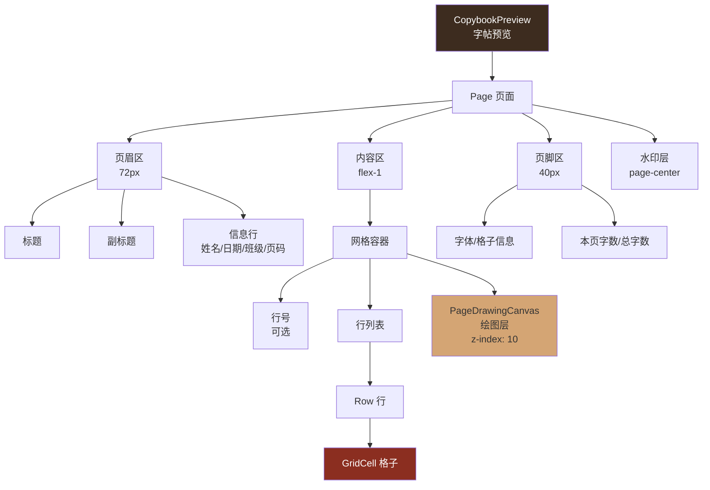

#### GridCell 组件（核心渲染单元）

**文件位置**：[GridCell.tsx](file:///Volumes/ExMac/traeProject/全站1/yq-34/src/components/Preview/GridCell.tsx)

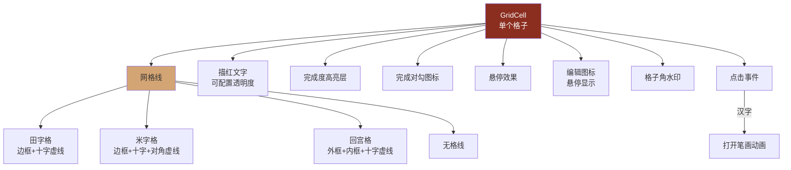

#### PageDrawingCanvas 组件（绘图层）

**文件位置**：[PageDrawingCanvas.tsx](file:///Volumes/ExMac/traeProject/全站1/yq-34/src/components/Preview/PageDrawingCanvas.tsx)

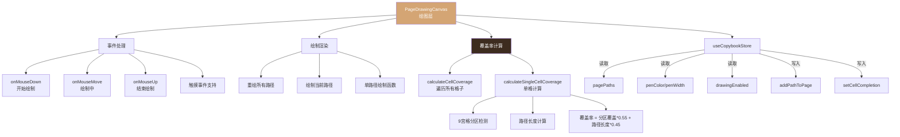

### 4.4 工具栏组件

**文件位置**：[DrawingToolbar.tsx](file:///Volumes/ExMac/traeProject/全站1/yq-34/src/components/Preview/DrawingToolbar.tsx)

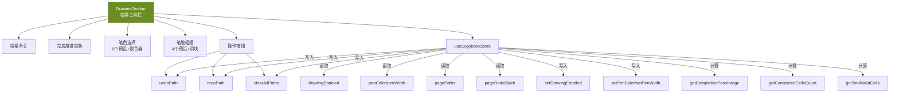

### 4.5 导出组件

**文件位置**：[ExportButton.tsx](file:///Volumes/ExMac/traeProject/全站1/yq-34/src/components/ExportButton.tsx)

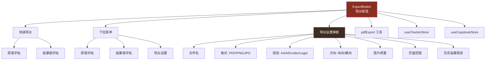

### 4.6 工具函数依赖

#### pdfExport.ts

**文件位置**：[pdfExport.ts](file:///Volumes/ExMac/traeProject/全站1/yq-34/src/utils/pdfExport.ts)

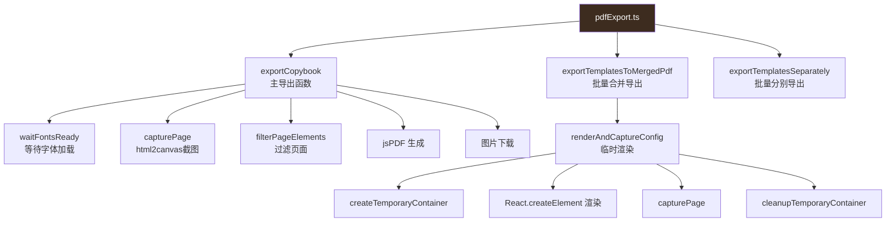

#### textParser.ts

**文件位置**：[textParser.ts](file:///Volumes/ExMac/traeProject/全站1/yq-34/src/utils/textParser.ts)

```mermaid
graph TD
    TP[textParser.ts] --> Tokenize[tokenizeText<br/>分词处理]
    TP --> Parse[parseTextToPages<br/>分页解析]
    TP --> Count[countValidChars<br/>统计有效字数]
    TP --> Extract[extractContentChars<br/>提取内容字符]
    
    Tokenize --> PageBreak[--- 分页符]
    Tokenize --> LineBreak[| 换行符]
    Tokenize --> Whitespace[跳过空白字符]
    
    Parse --> FlushPrimary[flushPrimary<br/>填满当前行]
    Parse --> FlushPage[flushPage<br/>填满当前页]
    Parse --> Direction[书写方向处理]
    Direction --> RTL[horizontal-rtl 行反转]
    Direction --> Vertical[vertical 行列转置]
    Direction --> VRTL[vertical-rtl 列反转]
    
    style TP fill:#D4A574
```

---

## 5. 核心数据结构

### 5.1 类型定义总览

**文件位置**：[types/index.ts](file:///Volumes/ExMac/traeProject/全站1/yq-34/src/types/index.ts)

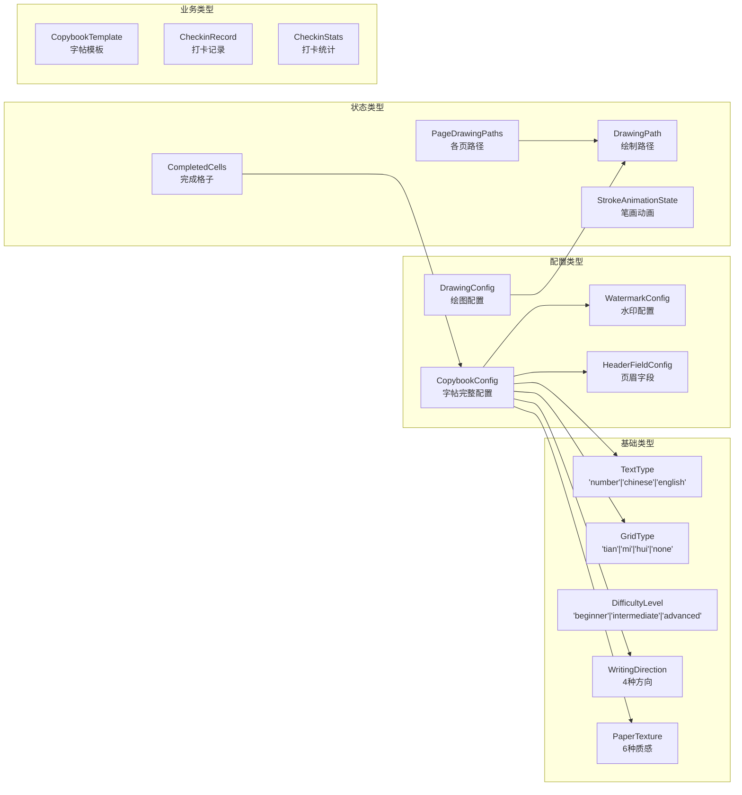

### 5.2 关键数据结构详解

#### CopybookConfig 字帖配置

```typescript
interface CopybookConfig {
  // 基础配置
  textType: TextType;           // 字帖类型
  text: string;                 // 文字内容
  fontId: string;               // 字体ID
  
  // 布局配置
  gridType: GridType;           // 网格类型
  cellSize: number;             // 格子大小 (32-120)
  colsPerRow: number;           // 每行字数 (4-20)
  rows: number;                 // 行数 (4-30)
  writingDirection: WritingDirection;  // 书写方向
  
  // 样式配置
  fontColor: string;            // 字体颜色
  gridColor: string;            // 网格颜色
  showDashed: boolean;          // 是否显示虚线
  showTrace: boolean;           // 是否显示描红
  traceOpacity: number;         // 描红透明度 (0.05-0.8)
  traceDisplayMode: TraceDisplayMode;  // 描红显示模式
  paperTexture: PaperTexture;   // 纸张质感
  
  // 页眉配置
  title: string;                // 标题
  subtitle: string;             // 副标题
  nameField: HeaderFieldConfig; // 姓名字段
  dateField: HeaderFieldConfig; // 日期字段
  classField: HeaderFieldConfig; // 班级字段
  headerPosition: HeaderPosition; // 页眉位置
  showLineNumbers: boolean;     // 是否显示行号
  
  // 水印配置
  watermark: WatermarkConfig;   // 水印配置
}
```

#### DrawingPath 绘制路径

```typescript
interface DrawingPath {
  points: { x: number; y: number }[];  // 坐标点数组
  color: string;                        // 画笔颜色
  lineWidth: number;                    // 画笔粗细
}

interface PageDrawingPaths {
  [pageIndex: number]: DrawingPath[];   // 按页存储路径
}
```

#### CompletedCells 完成格子

```typescript
interface CompletedCells {
  [pageIndex: number]: {
    [cellKey: string]: number;  // cellKey = "row-col", 值为 0-1 的完成度
  };
}

// 完成度阈值: COMPLETION_THRESHOLD = 0.6
// 超过 60% 视为完成
```

#### CheckinRecord 打卡记录

```typescript
interface CheckinRecord {
  date: string;                 // 日期 (YYYY-MM-DD)
  charCount: number;            // 字数
  textType: TextType;           // 字帖类型
  fontId: string;               // 字体ID
  timestamp: number;            // 时间戳
  posterThumbnail?: string;     // 海报缩略图 (base64)
}
```

---

## 6. 关键业务流程

### 6.1 字帖生成流程

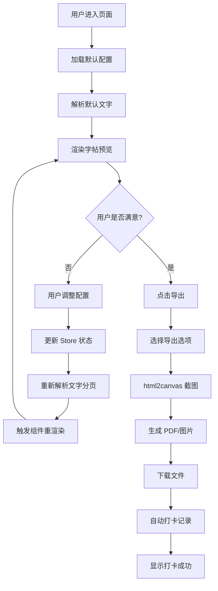

### 6.2 临摹练习流程

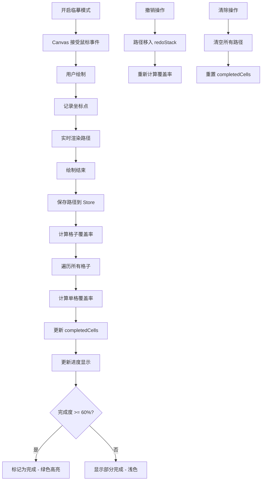

### 6.3 文字处理流程

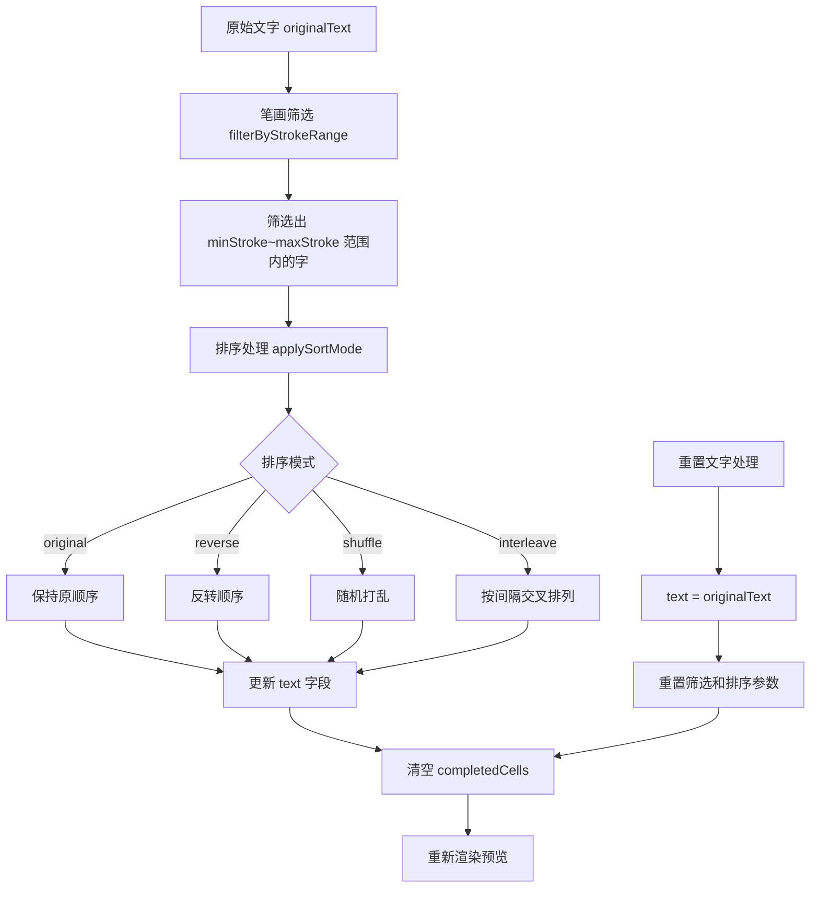

---

## 7. 状态持久化

### 7.1 Store 持久化配置

| Store | 持久化 Key | 持久化字段 |
|-------|-----------|-----------|
| **useCheckinStore** | `copybook-checkin-records` | `records` |
| **useTemplateStore** | `copybook-templates` | `templates` |
| **useFavoriteFontStore** | `copybook-favorite-fonts` | `favoriteFontIds` |
| **useCopybookStore** | - | 不持久化（每次重新加载） |

### 7.2 持久化数据流


---

## 8. 性能优化点

### 8.1 状态选择优化

使用 `useShallow` 进行浅层比较，避免不必要的重渲染：

```typescript
// 优化前 - 每次状态变更都重渲染
const { text, fontId } = useCopybookStore();

// 优化后 - 仅当依赖字段变更时重渲染
const { text, fontId } = useCopybookStore(
  useShallow((s) => ({
    text: s.text,
    fontId: s.fontId,
  }))
);
```

### 8.2 计算属性缓存

使用 `useMemo` 缓存 expensive 计算：

```typescript
// CopybookPreview 中
const parsed = useMemo(() => {
  return parseTextToPages(config.text, config.colsPerRow, config.rows, config.writingDirection);
}, [config.text, config.colsPerRow, config.rows, config.writingDirection]);
```

### 8.3 Canvas 绘制优化

- 使用 `devicePixelRatio` 处理高清屏
- 仅在 `drawingEnabled` 时计算覆盖率
- 使用 `requestAnimationFrame` 优化绘制性能
- 路径点距离过滤（distance > 1 才记录）

---

## 9. 组件依赖矩阵

| 组件 | useCopybookStore | useCheckinStore | useTemplateStore | useFavoriteFontStore | textParser | pdfExport | fonts |
|------|-----------------|-----------------|------------------|----------------------|------------|-----------|-------|
| **Home** | ✅ | ✅ | ✅ | ❌ | ❌ | ❌ | ❌ |
| **TextTypeSelector** | ✅ | ❌ | ❌ | ❌ | ❌ | ❌ | ❌ |
| **TextInput** | ✅ | ❌ | ❌ | ❌ | ✅ | ❌ | ❌ |
| **TextProcessor** | ✅ | ❌ | ❌ | ❌ | ❌ | ❌ | ❌ |
| **FontSelector** | ✅ | ❌ | ❌ | ✅ | ❌ | ❌ | ✅ |
| **GridConfig** | ✅ | ❌ | ❌ | ❌ | ❌ | ❌ | ❌ |
| **CopybookPreview** | ✅ | ❌ | ❌ | ❌ | ✅ | ❌ | ✅ |
| **GridCell** | ✅ | ❌ | ❌ | ❌ | ❌ | ❌ | ❌ |
| **PageDrawingCanvas** | ✅ | ❌ | ❌ | ❌ | ❌ | ❌ | ❌ |
| **DrawingToolbar** | ✅ | ❌ | ❌ | ❌ | ❌ | ❌ | ❌ |
| **ExportButton** | ✅ | ✅ | ❌ | ❌ | ❌ | ✅ | ❌ |
| **TemplateManager** | ✅ | ❌ | ✅ | ❌ | ❌ | ✅ | ❌ |
| **CalendarView** | ❌ | ✅ | ❌ | ❌ | ❌ | ❌ | ❌ |
| **PosterGenerator** | ❌ | ✅ | ❌ | ❌ | ❌ | ❌ | ❌ |

---

## 10. 关键代码位置速查表

| 功能模块 | 核心文件 | 核心函数/方法 |
|---------|---------|--------------|
| 状态管理 | [useCopybookStore.ts](file:///Volumes/ExMac/traeProject/全站1/yq-34/src/store/useCopybookStore.ts) | `setTextType`, `setDifficultyLevel`, `addPathToPage`, `setCellCompletion` |
| 打卡管理 | [useCheckinStore.ts](file:///Volumes/ExMac/traeProject/全站1/yq-34/src/store/useCheckinStore.ts) | `checkin`, `getStats`, `calcStreaks` |
| 模板管理 | [useTemplateStore.ts](file:///Volumes/ExMac/traeProject/全站1/yq-34/src/store/useTemplateStore.ts) | `saveTemplate`, `loadTemplateToConfig` |
| 主页面 | [Home.tsx](file:///Volumes/ExMac/traeProject/全站1/yq-34/src/pages/Home.tsx) | `ConfigSection`, `handleCheckinSuccess` |
| 字帖预览 | [CopybookPreview.tsx](file:///Volumes/ExMac/traeProject/全站1/yq-34/src/components/Preview/CopybookPreview.tsx) | `shouldShowTraceForCell`, `parseTextToPages` |
| 格子渲染 | [GridCell.tsx](file:///Volumes/ExMac/traeProject/全站1/yq-34/src/components/Preview/GridCell.tsx) | `renderGrid`, `handleClick` |
| 绘图层 | [PageDrawingCanvas.tsx](file:///Volumes/ExMac/traeProject/全站1/yq-34/src/components/Preview/PageDrawingCanvas.tsx) | `calculateSingleCellCoverage`, `drawPath` |
| 绘图工具栏 | [DrawingToolbar.tsx](file:///Volumes/ExMac/traeProject/全站1/yq-34/src/components/Preview/DrawingToolbar.tsx) | `handleUndo`, `handleRedo` |
| 导出按钮 | [ExportButton.tsx](file:///Volumes/ExMac/traeProject/全站1/yq-34/src/components/ExportButton.tsx) | `handleQuickExport`, `captureThumbnail` |
| 文字解析 | [textParser.ts](file:///Volumes/ExMac/traeProject/全站1/yq-34/src/utils/textParser.ts) | `parseTextToPages`, `tokenizeText` |
| PDF导出 | [pdfExport.ts](file:///Volumes/ExMac/traeProject/全站1/yq-34/src/utils/pdfExport.ts) | `exportCopybook`, `capturePage` |
| 字体管理 | [fonts.ts](file:///Volumes/ExMac/traeProject/全站1/yq-34/src/utils/fonts.ts) | `getFontById`, `getFontsByType` |
| 笔画处理 | [strokeCount.ts](file:///Volumes/ExMac/traeProject/全站1/yq-34/src/utils/strokeCount.ts) | `filterByStrokeRange`, `applySortMode` |
| 类型定义 | [types/index.ts](file:///Volumes/ExMac/traeProject/全站1/yq-34/src/types/index.ts) | `CopybookConfig`, `DrawingPath`, `CheckinRecord` |

---

## 11. 总结

### 11.1 架构特点

1. **单一数据源**：使用 Zustand 集中管理状态，避免 props drilling
2. **状态分层**：核心状态 + 持久化状态分离，职责清晰
3. **组件解耦**：配置组件与预览组件通过 Store 通信，无直接依赖
4. **性能优化**：广泛使用 `useShallow` 和 `useMemo` 减少重渲染
5. **用户体验**：实时预览、智能难度预设、临摹进度跟踪

### 11.2 核心设计模式

| 模式 | 应用场景 |
|------|---------|
| **观察者模式** | Zustand Store 订阅机制 |
| **策略模式** | 网格类型渲染(tian/mi/hui)、排序模式 |
| **状态模式** | 难度等级切换自动应用预设 |
| **命令模式** | 撤销/重做操作栈 |
| **工厂模式** | 导出格式创建(PDF/PNG/JPG) |

### 11.3 数据流特点

- **单向数据流**：用户操作 → Action → Store 更新 → 视图重渲染
- **响应式更新**：状态变更自动触发依赖组件重渲染
- **计算属性**：完成率、预估时长等派生数据实时计算
- **副作用隔离**：Canvas 绘制、PDF 导出等副作用独立处理
